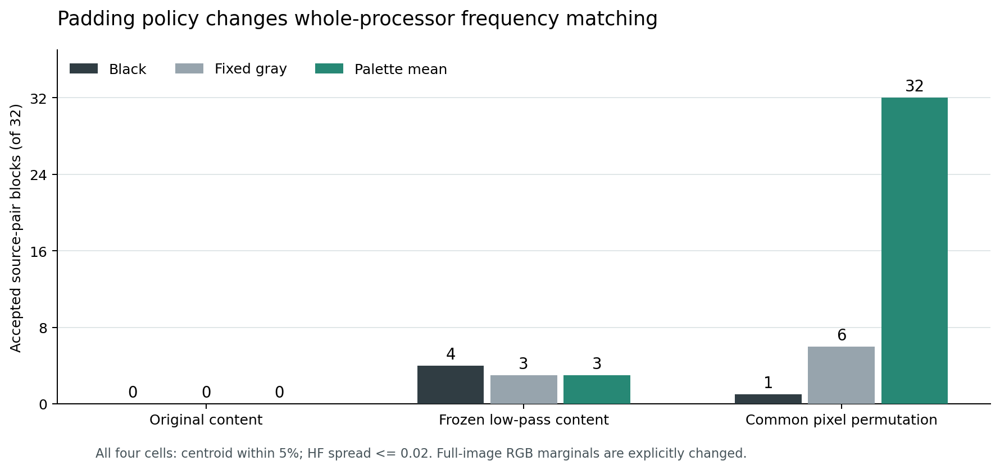
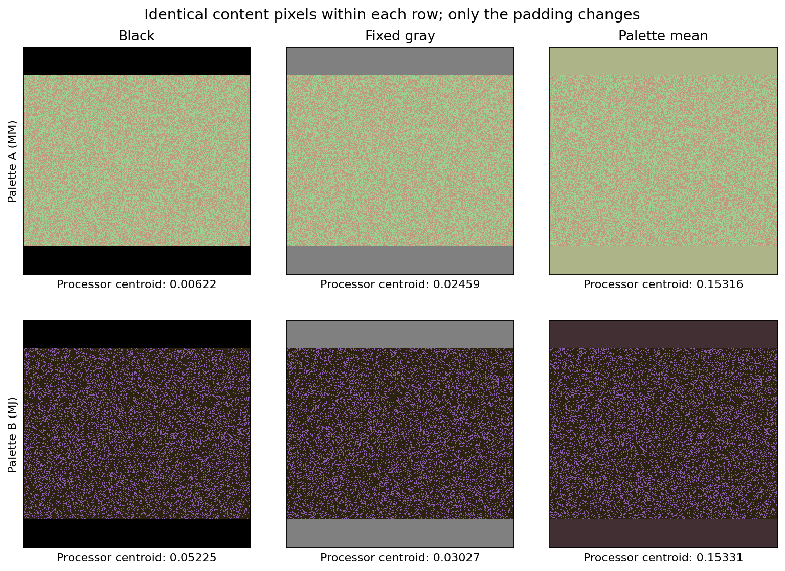

# Research Note 0045: Padding Policy And Explicit Marginals

Date: 2026-10-07

Status: all 1,152 input cells measured. Common permutation plus palette-mean
padding passes the registered whole-processor gates in 32/32 blocks and all
eight complete four-seed families. No new model-cache experiment was run.

## Question And Frozen Design

[Note 0044](0044_all_cell_frequency_control_feasibility.md) showed a large gap
between raw and actual-processor frequency matching. Its post-hoc audit located
a palette-coupled black exterior introduced by the actual FastVLM processor.
Here padding policy is independently varied while content pixels are fixed.
The added color distribution is explicitly part of the intervention.

The [Stage 4B protocol](../pairing_validation_protocol.md#stage-4b-padding-policy-comparison),
configuration and measurement implementation were committed as `a79da87`
before measuring the new policies. The design is:

- Eight existing ordered generator pairings, four existing seeds each: 32
  blocks, retaining all four `MM/JJ/MJ/JM` cells per block.
- Three content states: original, the prior selected low-pass result including
  every failed block, and the prior common pixel permutation. No low-pass
  cutoff is retuned under a new padding policy.
- Three padding policies: black `(0, 0, 0)`, fixed gray `(128, 128, 128)`, and
  the original palette's mean RGB rounded to uint8, nearest with ties to even.
- Each 320 x 240 content image is centered unchanged on a 320 x 320 canvas.
  The same palette supplies the same fill across spatial cells and content
  states; all 32 blocks appear in all nine conditions.
- The qualified full FastVLM processor is unchanged. Its snapshot revision is
  `81ffe929046666c43de53691147b1669ba0f3a4c`; implementation, configuration,
  source-receipt and measurement-code hashes were frozen before execution.

The acceptance gate uses the entire 1024 x 1024 processor output: each cell's
spectral centroid must be within 5% of the four-cell mean, with maximum
pairwise HF-ratio difference at most 0.02. Shape, finite/nondegenerate spectra,
registered expanded marginals, exact content and exact fill also pass their
checks. No support crop, changed tolerance or selected family rescues a failure.

## Results

Counts are accepted four-cell blocks out of 32, not independent image samples.

| Fixed content | Black | Fixed gray | Palette mean |
| --- | ---: | ---: | ---: |
| Original | 0/32 | 0/32 | 0/32 |
| Frozen low-pass | 4/32 | 3/32 | 3/32 |
| Common pixel permutation | 1/32 | 6/32 | **32/32** |



Common permutation plus palette-mean padding is the first condition in this
sequence to qualify all eight four-seed families under the whole-processor
input gate. Its blockwise maximum centroid relative error ranges from
0.0166% to 0.5938%, with median 0.3018%, against the unchanged 5% threshold.
Its largest HF spread is 0.001241, against 0.02.

All nine conditions meet the HF threshold in all blocks; the largest spread
anywhere is 0.004063. With the other checks satisfied, the centroid criterion
determines acceptance in this run. Matching these two summaries is not
matching the complete spectrum, orientation structure, texture or input vector.

Fixed-gray permutation qualifies only the white/blue-noise family in all four
seeds. Every other condition except palette-mean permutation qualifies zero
complete families. All failed blocks and continuous scores remain in the
publication; this is not a selected 32-block subset.

The black conditions exactly recover Note 0044's original, low-pass and
permutation input statistics and its 0/4/1 accepted-block counts. Mean padding
alone does not qualify the original images, and the previously selected
low-pass content remains largely unmatched. That bounded low-pass comparison
does not test every cutoff that could have been selected under a new policy.

## The Marginal Change Is Part Of The Result

The canvas retains 76,800 content pixels and adds 25,600 fill pixels. If `P`
is the original palette distribution and `f` the registered fill color, then

```text
P_canvas = 0.75 P + 0.25 delta_f
mu_canvas = 0.75 mu + 0.25 f
var_canvas = 0.75 var + 0.75 * 0.25 * (mu - f)^2
```

The last two identities apply per RGB channel. Palette-mean fill makes the
between-content/fill mean term small, subject to uint8 rounding. This provides
a useful explanation for the intervention, not an additive decomposition of
FFT centroid or proof of a cache mechanism.

All 1,152 canvases have unchanged content, exact registered fill and the exact
registered expanded joint RGB multiset. Within a palette, the two spatial
cells retain the same expanded marginal. **The original whole-image marginal
is not preserved.** The joint-RGB total-variation distance from the original
palette is exactly 0.25 in every measured cell: none of the added fill colors
occurs in its original palette.



The displayed checkerboard/hex r1 example uses identical content within each
row. For `MM/MJ`, black-padding processor centroids are 0.00622/0.05225 cpp;
palette-mean padding gives 0.15316/0.15331 cpp. The content is already permuted
in all six images. This is a padding-policy comparison conditional on that
content, not evidence that original macro geometry survived the transform.

Padding color and its added RGB mass change together. The design isolates the
choice of padding policy from changes to content, but does not identify a
padding effect independent of color marginals. The complete input-eligible
panel is a joint spatial-permutation and marginal-changing intervention.

## Pixel Sham Versus Model Equivalence

The explicit black-padding sham reproduces the original rectangular-input
processor pixel tensors bytewise in **384/384** content cells, with matching
shape and dtype. The historical input statistics also reproduce exactly.

However, full processor payload equality is **0/384**: `image_sizes` changes
from `[[320, 240]]` to `[[320, 320]]`. It is the only changed non-pixel key in
these comparisons. Equal pixel tensors therefore do not yet qualify model
execution or cache equality. No model weights were loaded here and the model
cache-calibration status remains `NOT_MEASURED`.

## Verification And Numerical Caveat

The independent offline verifier checked all 1,152 serialized images and
manifests, integer joint-RGB histograms, unchanged content, fill, palette
pairings, hashes, and all 288 four-cell gates. It reproduced all condition
counts and complete-family denominators from the per-cell ledger without
calling the original gate helper.

The frozen float64 moment checks reproduce with maximum residuals of
`8.56204e-13` for mean and `4.32016e-13` for variance, within their registered
`1e-12` bound. A separate integer-sum moment oracle found that the saved
float64-reduction expected mean differs from that reference by up to
`1.04594e-12`; 6/1,152 cells exceed `1e-12` on this additional comparison.
Variance's maximum oracle difference is `3.87315e-13`, with 0/1,152 exceeding
that bound. This small reduction-rounding discrepancy is preserved as
`PASS_WITH_FLOAT64_REDUCTION_CAVEAT`, not hidden by widening a tolerance or
rewriting the frozen measurements. Exact integer histogram identities hold
for every cell, and the originally defined moment gates are unchanged.

The repository suite passes 186 tests; the changed Python files pass Ruff.
These are implementation and artifact checks, not model-cache validation.

## Reading And Next Gate

This turns Note 0044's raw/processor mismatch into a measured intervention:
for the fixed permutation content, changing black to palette-mean padding
moves acceptance from 1/32 to 32/32. It does not show that padding explains all
earlier cache correspondence, that frequency alone has been manipulated, or
that the VLM creates or removes the input correspondence.

The next model stage should first compare historical rectangular inputs and
their explicit black-square shams through the unchanged qualified model path.
Record full processor payloads, actual source responses, cache coordinates,
and bytewise tensors at the frozen targets: L1 keys, L12 keys and L23 values.
Do not infer this calibration from the current pixel equality. Any mismatch
must remain explicit; do not substitute historical tensors or widen tolerance.

After that calibration, freeze the square-input comparison and separately
register the cache test on the complete accepted permutation/mean panel,
retaining the matched black comparator and explicit marginal intervention.
The existing two-reference/two-test split can be reused, but these are the
same known pairings and images, not a new independent cohort or unseen-pairing
transfer experiment. No new p-value or cache correspondence is reported here.
Selected source cells / tensors / factorials remain **616 / 1,704 / 426**;
direct-probe counts are also unchanged.

## Artifacts And Reproduction

- [Input specification](../../configs/padding_policy_fastvlm_v1.json)
- [Summary, all gates and frozen provenance](../../examples/research_notes/0045_padding_policy/summary.json)
- [Complete 1,152-cell ledger](../../examples/research_notes/0045_padding_policy/cells.jsonl)
- [Independent verification receipt](../../examples/research_notes/0045_padding_policy/verification.json)
- [Vector figure](../../examples/research_notes/0045_padding_policy/padding_acceptance.pdf)

The input-run command is in the registered protocol. Its full local receipt is
`runs/padding_policy_fastvlm_v1/padding_policy_summary.json`; original and
generated image manifests remain under the corresponding local `runs/`
directories. The committed ledger keeps all measured statistics and image
hashes, not the untracked PNG corpus. Figure export needs the optional `plots`
dependency; `--no-figures` exports JSON without Matplotlib. Publishing and
offline verification use:

```bash
python3 scripts/summarize_padding_policy_study.py \
  --input-summary runs/padding_policy_fastvlm_v1/padding_policy_summary.json \
  --output-root examples/research_notes/0045_padding_policy
python3 scripts/verify_padding_policy_publication.py \
  --publication examples/research_notes/0045_padding_policy \
  --live-summary runs/padding_policy_fastvlm_v1/padding_policy_summary.json \
  --prior-receipt runs/frequency_control_fastvlm_v1/input/input_acceptance.json
```

The verifier needs the hash-identified local input artifacts. A JSON-only
checkout can inspect the public measurements but cannot independently check
the absent image bytes.
