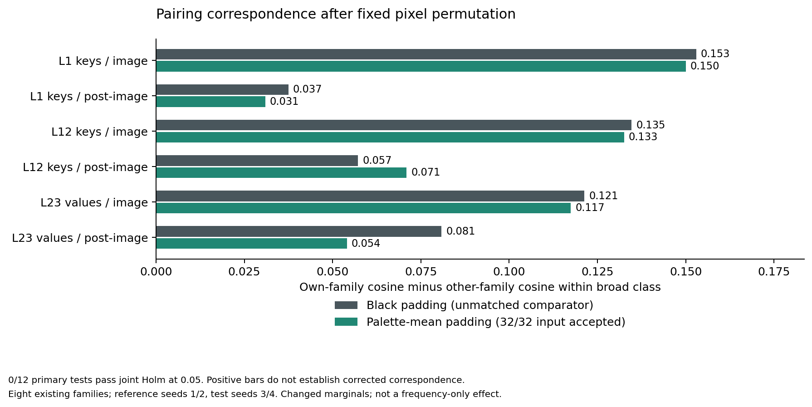

# Research Note 0046: Padding Cache Calibration And Matched Panel

Date: 2026-10-07

Status: calibration and both complete panels measured. All 792 calibration
comparisons are byte-identical. All twelve primary average correspondence
margins are positive, but none passes the registered joint Holm correction.

## Question And Sequence

[Note 0045](0045_padding_policy_and_explicit_marginals.md) qualified the first
complete whole-processor input panel: common pixel permutation plus
palette-mean padding, 32/32 blocks. Its black-padding sham reproduced pixel
tensors but changed `image_sizes`. This study first resolves that model-side
calibration, then measures the accepted panel and its fixed black comparator.

The [Stage 4C design](../pairing_validation_protocol.md#stage-4c-padding-cache-calibration-and-matched-panel),
configuration, capture implementation and tests were committed as `a5e96e3`
before any new model forward. Model revision, weight/tokenizer/processor
hashes, input receipts, historical runs and measurement-code hashes were
frozen before execution. The model remains
`mlx-community/FastVLM-0.5B-bf16`, revision
`81ffe929046666c43de53691147b1669ba0f3a4c`, under the qualified full model
processor path. No replacement native processor is introduced.

Targets remain zero-based L1 keys, L12 keys and L23 values. Every capture is a
fresh one-image source-context run, with seed 20260604, temperature zero and
a two-token generation budget. Actual generation-path prepared inputs are
recorded; a temporary audit hook delegates to the unchanged preparation
function and is restored afterward. Historical tensor reproduction also
checks that this instrumentation has not changed the measured execution.

## Calibration: Size Metadata Does Not Move These Tensors

| Comparison | Source captures | Tensor comparisons | Byte-identical |
| --- | ---: | ---: | ---: |
| All original rectangular cells versus qualified historical tensors | 128 new | 384 | 384/384 |
| Explicit original-content black squares versus the fresh rectangles | 128 new | 384 | 384/384 |
| Size-metadata-only crossing in fixed checkerboard/hex r1 anchor | 8 new | 24 | 24/24 |
| Total calibration | **264** | **792** | **792/792** |

For all 128 natural rectangular/black-square pairs, prepared inputs differ
only in `image_sizes`: `[[320, 240]]` versus `[[320, 320]]`. Pixel tensors,
token IDs and attention masks match. The fixed four-cell anchor additionally
crosses the metadata in both directions while leaving pixels unchanged.
Each crossed payload exactly matches the corresponding naturally prepared
counterpart. At all three targets, full tensors and every recorded token
region have maximum absolute difference zero.

This is consistent with the recorded installed implementation:
`mlx_vlm.models.fastvlm.fastvlm.Model.get_input_embeddings` does not use
`image_sizes`, and `fastvlm.language.LanguageModel.__call__` does not pass
that keyword into its language model. `stream_generate` does forward the
prepared extra fields, so this is not merely a missing metadata value in the
audit. Module paths and hashes are retained in the runtime identity record.
The conclusion is bounded to this single-image path, snapshot and selected
tensors; it does not establish that size metadata is irrelevant in other
architectures or configurations.

All calibration gates passed before the experimental panel began. Calibration
captures are not added to the selected experimental surface or reused as
experimental panel cells.

## Complete Panel And Primary Results

Both conditions use exactly the same common-permutation interior pixels:

- Black square padding: 1/32 input blocks accepted, retained explicitly as an
  unmatched comparator.
- Palette-mean square padding: 32/32 input blocks accepted, the complete
  registered two-frequency-summary-matched condition.

Their 128 paired prepared inputs differ **only in `pixel_values`**. Native
square metadata, tokens and masks match; no metadata override is used in the
panel. The pixel change includes the registered altered RGB mass. It is not
a frequency-only intervention or preservation of the original marginal.

All r1/r2 captures for both conditions were completed and their tensor hashes
frozen before any r3/r4 capture. There are 256 experimental source cells,
768 tensor sidecars and 192 factorial analyses: 96 reference and 96 test
analyses. Only r3/r4 vectors enter the test scores. The twelve primary tests
(two conditions x three targets x image/post-image) share one Holm family.

The margin is own-family cosine minus mean cosine with the other three
reference families in the same broad class, averaged equally across the
eight families. Exact tests use all 576 within-class complete-family
assignments. Retrieval is across all eight references, over 16 test seeds.

| Padding | Target / region | Margin | Positive families | Retrieval | Exact p | Holm p |
| --- | --- | ---: | ---: | ---: | ---: | ---: |
| Black | L1 keys / image | 0.15298 | 6/8 | 8/16 | 11/576 | 0.22917 |
| Black | L1 keys / post-image | 0.03746 | 6/8 | 3/16 | 25/576 | 0.26042 |
| Black | L12 keys / image | 0.13467 | 5/8 | 7/16 | 15/576 | 0.22917 |
| Black | L12 keys / post-image | 0.05719 | 4/8 | 4/16 | 94/576 | 0.44271 |
| Black | L23 values / image | 0.12131 | 5/8 | 7/16 | 13/576 | 0.22917 |
| Black | L23 values / post-image | 0.08086 | 5/8 | 5/16 | 42/576 | 0.36458 |
| Palette mean | L1 keys / image | 0.14998 | 7/8 | 6/16 | 12/576 | 0.22917 |
| Palette mean | L1 keys / post-image | 0.03092 | 5/8 | 3/16 | 51/576 | 0.36458 |
| Palette mean | L12 keys / image | 0.13255 | 5/8 | 7/16 | 13/576 | 0.22917 |
| Palette mean | L12 keys / post-image | 0.07094 | 6/8 | 4/16 | 85/576 | 0.44271 |
| Palette mean | L23 values / image | 0.11742 | 5/8 | 7/16 | 13/576 | 0.22917 |
| Palette mean | L23 values / post-image | 0.05407 | 5/8 | 6/16 | 87/576 | 0.44271 |



No primary view is unavailable and no retrieval is tied. All twelve average
margins are positive, but **0/12 pass Holm at 0.05**; the range of adjusted
p-values is 0.22917-0.44271. This does not establish absence of correspondence.
There are 32 negative family margins among 96 dependent primary family/view
records. All 48 exploratory head/band average margins are positive, with
118 negative family margins among 384 dependent family/view records. All
scores, including those negatives, remain in the snapshot; exploratory
p-values are unadjusted and do not rescue the primary result.

For context, the original, unpermuted panel in
[Note 0043](0043_fastvlm_pairing_holdout_and_input_baseline.md) had image
margins 0.27738-0.29912 and post-image margins 0.46036-0.54619, with 16/16
retrieval at every primary view. Those original observations remain valid
and their source tensors reproduce here. The new transformed panels have
substantially smaller descriptive margins and lower retrieval. The old six
tests and new twelve tests have different registered correction families;
comparing significance labels alone is not a test of their difference.

## Similar Scores Do Not Mean Similar Vectors

Changing black to palette-mean padding raises full-panel input eligibility
from 1/32 to 32/32. Yet image-region margins change by only -0.00300,
-0.00211 and -0.00389 at L1, L12 and L23. Post-image margin changes are
-0.00654, +0.01375 and -0.02679. These are descriptive paired differences,
not evidence of statistical equivalence or a frequency-mediated effect.

The underlying interaction vectors nevertheless change. The following are
median cosines between each block's black and mean-padding interaction
vectors, using all 32 paired blocks at each fixed target:

| Target | Image cosine | Post-image cosine |
| --- | ---: | ---: |
| L1 keys | 0.82235 | 0.18652 |
| L12 keys | 0.78321 | 0.36014 |
| L23 values | 0.73794 | 0.31335 |

These 96 target/block comparisons reuse the same 32 source blocks. They are
not 96 independent samples. A similar aggregate pairing margin can coexist
with substantial within-block directional change, especially in post-image
positions. This is distinct from the exact zero change in the metadata-only
calibration: padding **pixels** do affect the measured vectors even though
the tested size **metadata** does not.

## Localization, Counts And Verification

All 520 captures retain the source response `The image` and trace
`[785, 2168, 2168]`; the repeated last trace entry is not a third generated
token. Every tensor has shape `[1, 2, 397, 64]` and the validated 42 pre-image /
256 image / 99 post-image partition. No direct probe is added.

All 192 experimental factorials have exactly zero pre-image effects,
image-position interaction maxima and more than 0.9 of interaction energy
in image positions. Spatial/palette/interaction dominance is 44/52/0 for
black and 48/48/0 for palette mean, under both image and whole-effective
conventions. Each condition includes 48 reference and 48 test analyses;
references are not additional held-out outcomes. Localization persists even
though the earlier strong seed-correspondence result is not reconfirmed.

The selected experimental source cells / tensors / factorials increase from
616 / 1,704 / 426 to **872 / 2,472 / 618**. Of 606 partition-resolved analyses,
606 have zero pre-image effects and 600 have image-position interaction
maxima and image energy above 0.9. The 264 calibration cells / 792 tensors
remain separate. Direct-probe totals are unchanged.

Offline publication checks verified all 1,560 new tensor sidecars, all
792 calibration equalities, all 520 run/input-audit receipts, and the frozen
reference registry. All 1,536 primary reference/test cosines were independently
recomputed from the saved tensors. All 60 exact primary/exploratory assignment
tests were independently reconstructed from their saved cosine rows, and the
joint 12-test Holm calculation reproduced. Captured image bytes and tensor
sidecars remain local; their hashes and measured ledgers are committed.
No execution failure or rejected calibration occurred in this stage. The full
unit suite passes all 204 tests; Ruff passes on all new Python files.

## Interpretation And Next Experiment

The supported result has three parts:

1. The `image_sizes` discrepancy is resolved for this measured FastVLM path:
   natural shams and explicit metadata-only crossings preserve all selected
   cache tensors exactly.
2. An input-eligible permutation/mean panel is now measured through the model.
   Positive average margins remain, but the registered tests do not reconfirm
   the original strong known-pairing correspondence after permutation.
3. The large gain in input-summary matching between the two padding policies
   does not bring a corresponding gain in image-region pairing margins.
   This does not make padding irrelevant: the vectors themselves change.

Both new conditions destroy the original spatial arrangement. Their shared
weakening motivates examining spatial organization more directly, but the
experiment does not isolate macro geometry, frequency, color marginals or
a semantic mechanism. The average-margin reduction is descriptive, not a
separate registered test of the cross-condition difference. Failure to reject
the exact reference is not proof of no residual correspondence.

Reference directions exclude test-cache vectors, but Note 0045 used all four
seeds' input statistics to choose this matching condition. This is a
registered cache diagnostic on an input-selected, already observed cohort,
not fully untouched held-out validation. No unseen-family transfer,
persistence, adaptation or cache-to-readout mediation is established.

A narrow next experiment is to keep palette-mean padding, expanded RGB
marginals and native size metadata fixed, then vary the amount or block scale
of the common interior permutation. Audit all four cells' frequency summaries
at every level before deciding which comparisons qualify as matched. That
would separate the current all-or-nothing scrambling step from the calibrated
padding choice; it still must not be called a geometry-only intervention.

## Artifacts And Reproduction

- [Registered configuration](../../configs/padding_cache_fastvlm_v1.json)
- [Full result snapshot and verification counts](../../examples/research_notes/0046_padding_cache/summary.json)
- [520 capture and prepared-input records](../../examples/research_notes/0046_padding_cache/captures.jsonl)
- [792 detailed calibration comparisons](../../examples/research_notes/0046_padding_cache/calibration_checks.jsonl)
- [Vector figure](../../examples/research_notes/0046_padding_cache/pairing_margins.pdf)

The live root is `runs/padding_cache_fastvlm_v1/`. Reproduction needs the
hash-identified local historical and Note 0045 image/tensor artifacts; a
JSON-only checkout does not contain those tensor bytes. The capture runner
rejects an existing output root unless `--resume` verifies the exact frozen
specification. `--preflight-only` freezes and checks artifacts without loading
the model; continue it with `--resume`.

```bash
HF_HUB_OFFLINE=1 TRANSFORMERS_OFFLINE=1 python3 scripts/run_padding_cache_study.py \
  --config configs/padding_cache_fastvlm_v1.json \
  --input-summary runs/padding_policy_fastvlm_v1/padding_policy_summary.json \
  --published-input examples/research_notes/0045_padding_policy/summary.json \
  --historical-root runs/fastvlm_pairing_seed_validation_v1 \
  --output-root runs/padding_cache_fastvlm_v1

python3 scripts/summarize_padding_cache_study.py \
  --run-root runs/padding_cache_fastvlm_v1 \
  --output-root examples/research_notes/0046_padding_cache
```
