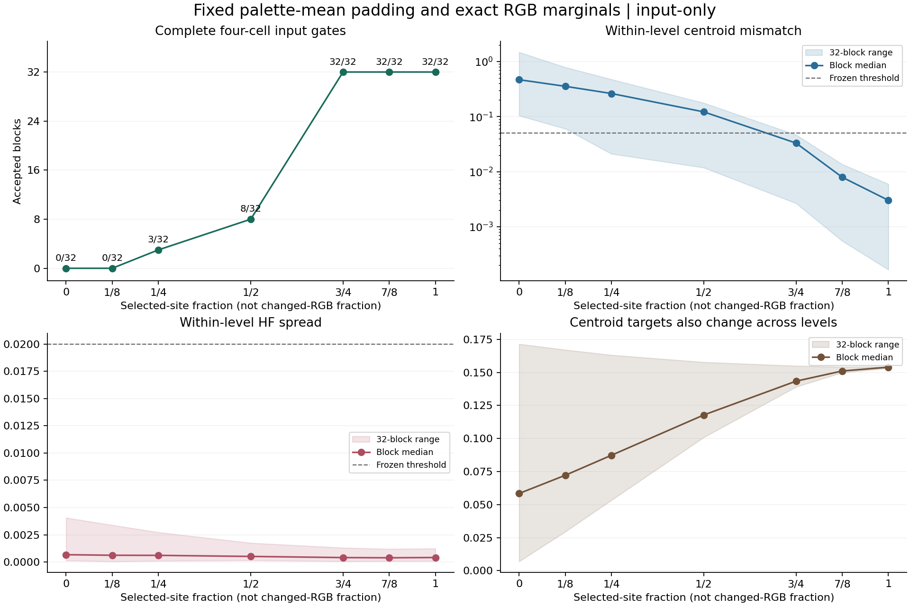
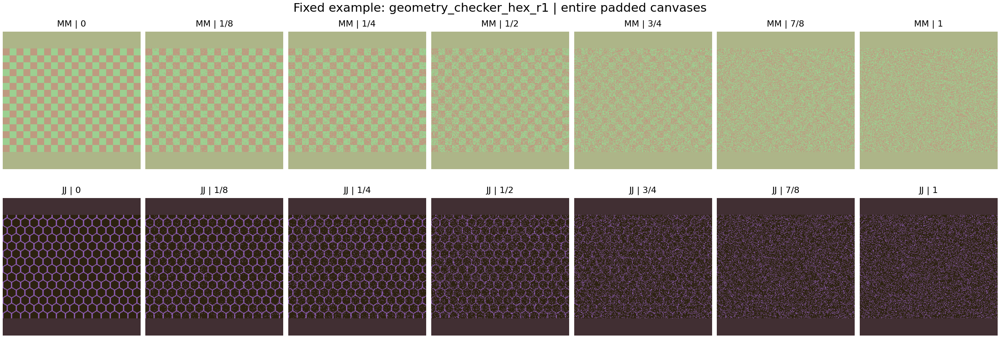

# Research Note 0047: Graded Permutation Under Fixed Marginals

Date: 2026-10-08

Status: all 896 input cells and 224 four-cell gates measured and independently
verified. The 3/4, 7/8 and full-permutation levels pass all 32 blocks. No new
cache forwards, model weights or primary cache tests are added.

## Why Grade The Permutation?

[Note 0046](0046_padding_cache_calibration_and_matched_panel.md) separated
size metadata from padding pixels, then found weaker pairing correspondence
after complete common permutation. Input-summary matching alone did not
restore the original strong cache result. The remaining question is how much
spatial rearrangement is required for a complete input-eligible panel while
holding padding and the expanded RGB distribution fixed.

The [Stage 4D registration](../pairing_validation_protocol.md#stage-4d-graded-permutation-under-fixed-marginals),
configuration, transform implementation and 17 new tests were committed as
`f99c19c` before any new input measurement. The seven fractions were fixed at
0, 1/8, 1/4, 1/2, 3/4, 7/8 and 1. No extra levels or seeds were searched after
observing acceptance. All 32 existing four-cell blocks, including failures,
remain in the denominator.

## Transform And Fixed Controls

Let `P` be the exact historical common permutation, interpreted as an output
site's source index. Draw one independent panel-wide selection order with
seed 20261008. For each fraction, select the corresponding prefix of that
order. At selected sites, follow `P` until the next selected site in the same
cycle; fix every unselected site. Equivalently, restrict each cycle to its
selected sites. The same resulting bijection applies to all four cells and
all source blocks.

This construction gives an exact identity endpoint and an exact historical
permutation endpoint. It moves complete RGB triplets without interpolation,
and each step has an exact inverse. Selected-site sets are nested, but an
already selected site's destination can change at the next level. A singleton
selected cycle stays fixed. The fraction is not a claim of monotone spectral,
perceptual or semantic change, and it is not a local block-shuffle scale.

Each cell retains its original 240 x 320 content multiset, with 40 rows of
palette-mean fill above and below on a 320 x 320 canvas. All levels retain:

- The exact same expanded joint RGB counts for that cell/palette donor.
- The same 75% original-palette plus 25% constant-fill distribution.
- The same donor-derived fill color and exterior locations.
- Native `image_sizes = [[320, 320]]` and all non-pixel processor fields.
- The qualified FastVLM model-loading processor and its exact provenance.

Different palette donors still have different distributions. Fixed marginals
across levels do not mean equal marginals across the factorial or preservation
of the unpadded image's marginal. Processor-space marginals are not asserted
to be invariant under spatial rearrangement and resampling.

## All Seven Input Results

The unchanged gate compares all four cells **within each block and level**:
at most 5% relative deviation from their common spectral-centroid target,
at most 0.02 maximum HF-ratio difference, finite nondegenerate spectra,
matching processor shapes, exact expanded marginals and the frozen moment
check. Whole processor images are used, without support-only cropping.

| Selected fraction | Accepted blocks | Complete four-seed families | Worst centroid error | Worst HF spread | Retained grid edges |
| --- | ---: | ---: | ---: | ---: | ---: |
| 0 | 0/32 | 0/8 | 147.513% | 0.004063 | 100.000% |
| 1/8 | 0/32 | 0/8 | 78.665% | 0.003391 | 76.523% |
| 1/4 | 3/32 | 0/8 | 47.438% | 0.002730 | 56.170% |
| 1/2 | 8/32 | 2/8 | 17.692% | 0.001751 | 24.958% |
| 3/4 | **32/32** | **8/8** | **4.661%** | 0.001311 | 6.289% |
| 7/8 | **32/32** | **8/8** | **1.361%** | 0.001202 | 1.585% |
| 1 | **32/32** | **8/8** | **0.594%** | 0.001241 | 0.003921% |



The first complete level in this grid is **3/4**, not necessarily a threshold
at precisely 75%. There were no measurements between 1/2 and 3/4, and only
one fixed selection order was tested. At 1/2 the two complete families are
`geometry_voronoi_quasicrystal` and `stochastic_white_blue_noise`; that subset
does not qualify the complete eight-family design.

Every HF gate and moment check passes at every level. All 117 rejected
block/level gates fail the centroid requirement. The acceptance curve is
therefore driven by the four-cell centroid criterion on this dataset, not
by changing tolerances or an RGB-count failure. The three complete levels
remain input-eligible, not cache-validated.

The centroid implementation uses Fourier radius divided by the maximum
radius; reported targets are normalized radial units, not cycles per pixel.
HF energy uses the unchanged normalized-radius cutoff 0.35.

## A Fraction Is Not A Spatial Or Spectral Dose

Retained grid edges count output horizontal/vertical neighbors whose source
indices remain undirected four-neighbor neighbors. This is a property of the
index mapping, not a semantic or perceptual score. At the first complete
level, only 6.289% of those adjacency relations remain. The full permutation
retains six edges by chance. All 32 blocks share each mapping, so these are
not 32 independent spatial-randomization samples.

Index movement and changed RGB values also differ when colors repeat. At
3/4, 74.999% of indices move but changed-RGB fractions range from 20.563% to
74.999% across the 128 cells (median 66.447%). At the full endpoint the median
is 88.576%, with a range of 27.323%-99.997%. Neither selected fraction nor
changed RGB fraction is a calibrated measure of visual meaning.



The montage uses the fixed `geometry_checker_hex_r1` MM and JJ cells and
shows entire padded canvases. It is illustrative, not an additional outcome.

Crucially, passing within-level gates does not equate spectra **between**
levels. The median common centroid target is 0.143348 at 3/4, 0.151047 at
7/8, and 0.153920 at 1. For each block, the target ratio to its full endpoint
minus one ranges from -9.797% to +0.925% at 3/4, and from -2.653% to +0.425%
at 7/8. These descriptive contrasts are not a newly registered cross-level
matching test. Spatial rearrangement and processor frequency remain coupled.

## Verification And Counts

The publication verifier uses a separate successor-following implementation
to reconstruct the seven mappings. It checks actual serialized image bytes,
integer RGB counts and inverse roundtrips, and independently reconstructs
all registered acceptance gates.

| Check | Verified |
| --- | ---: |
| Independently reconstructed bijections | 7/7 |
| Exact expanded joint RGB histograms | 896/896 |
| Inverse pixel roundtrips | 896/896 |
| Fixed padding and non-pixel processor metadata | 896/896 |
| Historical original/full endpoint pixel, statistic and gate checks | 256/256 |
| Independently reconstructed four-cell gates | 224/224 |

All code, processor, selection-map, prior receipt and serialized artifact
hashes reproduce. The separate integer-moment oracle has maximum absolute
mean/variance discrepancies of 9.832e-13 / 1.156e-13, with zero cells above
1e-12. No rounding exception, rejected provenance check or execution failure
occurred in this stage. The complete unit suite passes 232 tests; Ruff passes
on the new Python files.

This stage loads no model weights and adds **zero cache forwards**. The
selected experimental cache counts remain **872 source cells / 2,472 tensor
sidecars / 618 factorial analyses**. Note 0046's calibration and cache results
are not replaced or counted again. All input seeds have already been
observed; a later cache experiment would be input-selected, not untouched
held-out validation or a new image cohort.

## Reading And Next Experiment

This is now a three-level complete input panel, not just a fully scrambled
endpoint. The supported statement is narrow: under fixed expanded RGB
marginals and padding, the selected common permutations at 3/4, 7/8 and 1
all satisfy the existing within-level two-summary gates.

That opens a cache comparison at the same L1 keys / L12 keys / L23 values
targets. A subsequent registration should freeze these three levels, retain
the original reference/test split, recheck the full endpoint against Note
0046, and define its multiplicity family before any new cache capture.
Correspondence margins and paired vector directions should be reported
separately. The 1/2 level remains a possible explicitly unmatched diagnostic,
not a silently rescued matched condition.

Such a comparison could locate changes in pairing correspondence along this
particular transformation path. It would not isolate geometry from frequency,
identify a universal 75% transition, or establish semantic or persistent-state
steering. The cache behavior at the new intermediate levels is **unmeasured**.

## Artifacts And Reproduction

- [Registered configuration](../../configs/graded_permutation_fastvlm_v1.json)
- [Complete result and verification snapshot](../../examples/research_notes/0047_graded_permutation/summary.json)
- [All 896 measured cells](../../examples/research_notes/0047_graded_permutation/cells.jsonl)
- [Vector audit figure](../../examples/research_notes/0047_graded_permutation/graded_input_audit.pdf)

Raw image manifests and index-map arrays remain under
`runs/graded_permutation_fastvlm_v1/`. Reproduction requires the hash-identified
historical input artifacts and the qualified local processor snapshot. Both
commands require a fresh output directory; interrupted runs are preserved,
not overwritten. No remote inference service is used.

```bash
HF_HUB_OFFLINE=1 TRANSFORMERS_OFFLINE=1 python3 scripts/run_graded_permutation_study.py \
  --config configs/graded_permutation_fastvlm_v1.json \
  --padding-receipt runs/padding_policy_fastvlm_v1/padding_policy_summary.json \
  --published-padding examples/research_notes/0045_padding_policy/summary.json \
  --frequency-receipt runs/frequency_control_fastvlm_v1/input/input_acceptance.json \
  --full-permutation runs/frequency_control_fastvlm_v1/input/shared_pixel_permutation.npy \
  --fastvlm-model-processor-snapshot /path/to/81ffe929046666c43de53691147b1669ba0f3a4c \
  --output-root runs/graded_permutation_fastvlm_v1

python3 scripts/summarize_graded_permutation_study.py \
  --source runs/graded_permutation_fastvlm_v1/graded_permutation_summary.json \
  --output-root examples/research_notes/0047_graded_permutation
```
