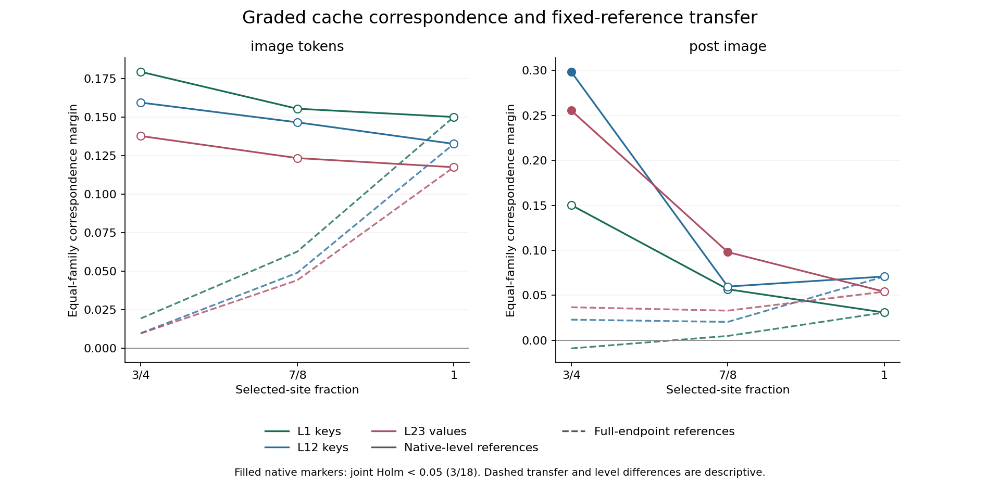
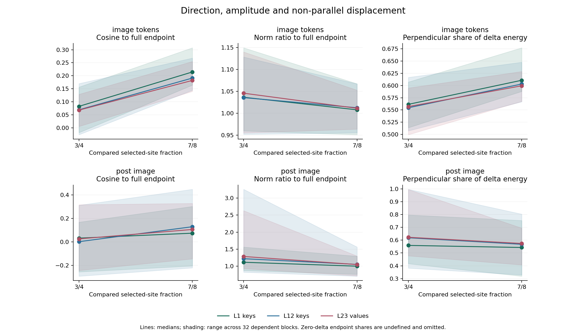

# Research Note 0048: Graded Cache Correspondence And Direction

Date: 2026-10-08

Status: registered experiment executed; tensor-level publication checks passed.

## Main Result

The three input-eligible levels from
[Note 0047](0047_graded_permutation_under_fixed_marginals.md) now have cache
measurements. The result separates three different questions:

1. **Within a transformation, does pairing direction repeat across seeds?**
   Three of 18 primary tests pass joint Holm correction (`p=0.03125`):
   post-image L12 keys and L23 values at 3/4, and post-image L23 values at 7/8.
   Every average margin is positive, but 37/144 family-view margins are negative.
2. **Does a reference from full permutation describe intermediate conditions?**
   Replacing only the reference vectors by full-endpoint references lowers
   all twelve average margins. This does not lower every retrieval count.
3. **Is the change simply a shorter version of the endpoint interaction?**
   No: at 3/4, image-region norm ratios have medians 1.036-1.046 while paired
   endpoint cosines have medians only 0.068-0.082. Comparable lengths coexist
   with weak directional alignment.

The bounded reading is **transformation-conditioned pairing correspondence**,
not one invariant direction whose strength only fades. This does not isolate
geometry, frequency, semantics, or the common permutation template as a cause.

## Frozen Design And Calibration

The [Stage 4E registration](../pairing_validation_protocol.md#stage-4e-graded-cache-correspondence-transfer-and-direction)
and [configuration](../../configs/graded_cache_fastvlm_v1.json) were committed
at `6918baaa523b0b7dc8849ca359d9205b839f846f` before the new model forwards.
Measurement code, qualified model snapshot, runtime, input receipts and
historical endpoint artifacts were hashed before execution.

- Levels: selected-site fractions 3/4, 7/8 and 1; no unmatched 1/2 condition.
- Eight ordered generator pairings, four seeds each, four factorial cells:
  32 blocks per level. These are reused source images, not a new cohort.
- All 192 r1/r2 panel captures were frozen before any r3/r4 panel capture.
  Test-cache vectors never enter reference construction.
- Unchanged FastVLM-0.5B-bf16 snapshot
  `81ffe929046666c43de53691147b1669ba0f3a4c` and actual model processor.
- Zero-based L1 keys, L12 keys and L23 values; source seed 20260604,
  temperature zero, two-token generation budget.
- Native bfloat16 tensors stored as float32, shape `[1,2,397,64]`:
  42 pre-image, 256 image and 99 post-image positions.
- Every one of the 512 captures returns `The image`. Trace
  `[785,2168,2168]` retains its repeated final entry; it is not three generated
  tokens or a substituted `ACK`.

Before the experimental panel, 128 separate full-endpoint calibration captures
reproduce **384/384** historical tensors bytewise. Their actual prepared inputs
also match. The panel then adds 384 fresh captures / 1,152 tensors / 288
factorials. Its 128 full-endpoint cells reproduce another **384/384** tensors
exactly. All 768 comparisons have maximum absolute difference zero.

The 256 intermediate panel captures differ from their historical endpoint
prepared inputs only in `pixel_values`. All full-endpoint panel payloads match
exactly. Expanded RGB counts, palette-mean padding and square
`image_sizes=[[320,320]]` stay fixed across levels. The 128 endpoint panel
captures are explicitly repeated conditions, not new stimuli. Calibration
captures are counted separately and never substitute for panel references.

## Within-Level Correspondence

Each r1/r2 interaction vector is unit-normalized before forming its family
reference. A test seed's margin compares its own-family cosine with the mean
of the other three families in the same broad class. Family means receive
equal weight. Retrieval instead ranks all eight family references, so it is
not interchangeable with this margin.

The exact test moves complete two-test-seed family blocks within each broad
class, enumerating `4! x 4! = 576` assignments. All 18 primary tests share
one Holm family. `Positive` is the number of positive family margins out of
eight; retrieval uses 16 test seeds. There are no unavailable primary views
or retrieval ties.

| Fraction | Target | Region | Margin | Retrieval /16 | Positive /8 | Raw p | Holm p |
| --- | --- | --- | ---: | ---: | ---: | ---: | ---: |
| 3/4 | L1 keys | image | 0.179261 | 10 | 7 | 5/576 | 0.112847 |
| 3/4 | L1 keys | post | 0.150343 | 9 | 7 | 2/576 | 0.052083 |
| 7/8 | L1 keys | image | 0.155346 | 7 | 6 | 17/576 | 0.250000 |
| 7/8 | L1 keys | post | 0.056752 | 5 | 6 | 4/576 | 0.097222 |
| 1 | L1 keys | image | 0.149979 | 6 | 7 | 12/576 | 0.250000 |
| 1 | L1 keys | post | 0.030916 | 3 | 5 | 51/576 | 0.265625 |
| 3/4 | L12 keys | image | 0.159321 | 8 | 5 | 17/576 | 0.250000 |
| 3/4 | L12 keys | post | 0.298429 | 9 | 7 | 1/576 | **0.031250** |
| 7/8 | L12 keys | image | 0.146519 | 6 | 6 | 19/576 | 0.250000 |
| 7/8 | L12 keys | post | 0.059757 | 5 | 6 | 15/576 | 0.250000 |
| 1 | L12 keys | image | 0.132553 | 7 | 5 | 13/576 | 0.250000 |
| 1 | L12 keys | post | 0.070941 | 4 | 6 | 85/576 | 0.295139 |
| 3/4 | L23 values | image | 0.137663 | 9 | 5 | 14/576 | 0.250000 |
| 3/4 | L23 values | post | 0.255450 | 11 | 7 | 1/576 | **0.031250** |
| 7/8 | L23 values | image | 0.123348 | 7 | 5 | 20/576 | 0.250000 |
| 7/8 | L23 values | post | 0.098089 | 7 | 7 | 1/576 | **0.031250** |
| 1 | L23 values | image | 0.117420 | 7 | 5 | 13/576 | 0.250000 |
| 1 | L23 values | post | 0.054067 | 6 | 5 | 87/576 | 0.295139 |

Only the three bold entries pass 0.05. L1 keys post-image at 3/4 does **not**
pass (`0.052083`); rounding must not turn it into a fourth positive result.
Image-region mean margins decrease across these three levels descriptively,
but none passes joint Holm. L12 post-image is not monotone: its 7/8 margin
is below the full endpoint's. Different significance labels are not a test
of a between-level difference.

All 72 fixed head/band views have positive average margins, but 152/576
exploratory family-view margins are negative. They remain unadjusted,
exploratory views, not additional primary successes. All negatives and
per-seed scores are retained in the published summary.

The six raw full-endpoint results reproduce Note 0046 exactly, including
cosines, margins, retrieval and exact p-values. Their adjusted values differ
because the correction family is now 18 tests, not the earlier twelve.



## Endpoint-Reference Transfer

Only r1/r2 references are replaced by full-endpoint vectors; each intermediate
level's r3/r4 test vectors remain unchanged. These twelve comparisons are
descriptive, with no additional inferential test family.

| Fraction | Target | Region | Native margin | Endpoint-ref margin | Native retrieval /16 | Endpoint-ref retrieval /16 |
| --- | --- | --- | ---: | ---: | ---: | ---: |
| 3/4 | L1 keys | image | 0.179261 | 0.019395 | 10 | 1 |
| 3/4 | L1 keys | post | 0.150343 | -0.008993 | 9 | 0 |
| 3/4 | L12 keys | image | 0.159321 | 0.009838 | 8 | 2 |
| 3/4 | L12 keys | post | 0.298429 | 0.022964 | 9 | 3 |
| 3/4 | L23 values | image | 0.137663 | 0.009673 | 9 | 3 |
| 3/4 | L23 values | post | 0.255450 | 0.036776 | 11 | 5 |
| 7/8 | L1 keys | image | 0.155346 | 0.062735 | 7 | 8 |
| 7/8 | L1 keys | post | 0.056752 | 0.004881 | 5 | 3 |
| 7/8 | L12 keys | image | 0.146519 | 0.048986 | 6 | 7 |
| 7/8 | L12 keys | post | 0.059757 | 0.020471 | 5 | 3 |
| 7/8 | L23 values | image | 0.123348 | 0.044168 | 7 | 10 |
| 7/8 | L23 values | post | 0.098089 | 0.032994 | 7 | 4 |

All twelve average margins fall, but all three 7/8 image retrieval counts
increase. It would be incorrect to say that transfer universally destroys
retrieval. Margin and all-family rank answer different questions.

At 3/4, the strong native post-image margins in L12/L23 become much smaller
under endpoint references. The observed correspondence therefore cannot be
summarized as the same endpoint-reference prediction merely becoming stronger.

## Direction Versus Amplitude

For each block, target and region, let `a` be its higher-fraction interaction
vector and `b` its lower-fraction vector. The registered decomposition is:

```text
alpha = dot(a, b) / dot(a, a)
parallel_delta = (alpha - 1) * a
perpendicular_delta = b - alpha * a
b - a = parallel_delta + perpendicular_delta
```

All three level pairs are retained: 576 dependent records, with reference and
test phases identifiable. Below are medians across all 32 blocks for the two
comparisons to the full endpoint. Each column is a separately computed
median. These are descriptions, not 32 independent randomizations of a map.

| Fraction | Target | Region | Cosine to full | Norm ratio | Alpha | Perpendicular share of delta energy |
| --- | --- | --- | ---: | ---: | ---: | ---: |
| 3/4 | L1 keys | image | 0.082480 | 1.036495 | 0.083456 | 0.561486 |
| 3/4 | L1 keys | post | 0.032140 | 1.115961 | 0.030715 | 0.559137 |
| 3/4 | L12 keys | image | 0.069250 | 1.035606 | 0.075795 | 0.554496 |
| 3/4 | L12 keys | post | 0.001778 | 1.220554 | 0.008030 | 0.618831 |
| 3/4 | L23 values | image | 0.067986 | 1.045730 | 0.072359 | 0.556863 |
| 3/4 | L23 values | post | 0.025546 | 1.285903 | 0.035593 | 0.622610 |
| 7/8 | L1 keys | image | 0.214532 | 1.007725 | 0.218905 | 0.610761 |
| 7/8 | L1 keys | post | 0.074221 | 1.001086 | 0.073045 | 0.542841 |
| 7/8 | L12 keys | image | 0.191076 | 1.012451 | 0.193370 | 0.603060 |
| 7/8 | L12 keys | post | 0.129316 | 1.053952 | 0.129108 | 0.567918 |
| 7/8 | L23 values | image | 0.182077 | 1.011200 | 0.185680 | 0.599479 |
| 7/8 | L23 values | post | 0.106049 | 1.047996 | 0.107308 | 0.574240 |

The image interaction length barely changes at 3/4 while its paired direction
is weakly aligned with full permutation. Post-image lengths also change, and
block ranges are broad, so this is not a claim of pure rotation. The test-only
L12 post-image cosine median at 3/4 is -0.017602; phase-separated summaries
remain available rather than hiding that difference in a pooled median.

The perpendicular fraction describes **the energy of the change `b-a`**, not
the share of `b`, semantic variance, or a causal component. The maximum relative
Pythagorean residual is `3.26e-16` (rounded upward). Undefined zero-denominator
cases remain null in the implementation and are covered by tests.



Lines show medians; shading is the observed range, not a confidence interval.

## Localization And Denominators

All 288 panel factorials have zero pre-image effects, image-position
interaction argmaxes, and image interaction energy fractions above 0.9.
None is interaction-dominant under the balanced three-axis convention.

| Fraction | Image spatial / palette / interaction | Whole spatial / palette / interaction |
| --- | --- | --- |
| 3/4 | 57 / 39 / 0 | 57 / 39 / 0 |
| 7/8 | 52 / 44 / 0 | 51 / 45 / 0 |
| 1 | 48 / 48 / 0 | 48 / 48 / 0 |

The cumulative executed panel surface is now 1,256 source cells / 3,624 tensors
/ 906 factorials. It includes this stage's 128 / 384 / 96 repeated endpoint
observations. Excluding only those current-stage repeats gives 1,128 / 3,240 /
810; neither tally is a count of independent stimuli. The additional 128 /
384 calibration captures/tensors remain outside both panel totals.

Of 894 partition-resolved cumulative analyses, all 894 have zero pre-image
effects; 888 have image interaction maxima and 888 have image energy fractions
above 0.9. Direct-probe counts are unchanged: this stage has no readout forward.

## Input Confounds And Claim Ceiling

Within-level acceptance does not mean equal spectra between levels. Across
the 32 blocks, common centroid targets relative to the full endpoint change
by a median -6.842% at 3/4 (range -9.797% to +0.925%) and -1.833% at 7/8
(range -2.653% to +0.425%). Per-cell centroid and HF summaries and all 96
block/level contexts are retained. No dependent-distance correlation is used
as independent statistical evidence.

All images informed input eligibility, the full endpoint was already observed
in Note 0046, and one shared selection/permutation order spans all blocks.
Reference/test separation is real for cache-reference construction, but this
is not fully untouched validation or unseen-pairing generalization.

The result supports condition-specific seed correspondence in selected
post-image views and separates it from cross-condition vector alignment.
It does not establish a universal 75% transition, a statistical between-level
difference, geometry-only causality, full-spectrum equality, semantic
specificity, state persistence or cache-to-readout mediation.

## Verification And Artifacts

The publication exporter independently reloads saved tensors and recomputes:

- 1,536 tensor sidecar integrity checks and 768 endpoint equalities;
- 2,304 primary reference cosines and 1,536 transfer cosines;
- all 90 exact assignment tests (18 primary plus 72 exploratory), with a
  separately reconstructed joint Holm family of 18;
- all 576 directional decompositions and six raw historical endpoint results.

The full repository test suite passes: **256 tests**. The 24 added tests cover
measurement/decomposition contracts and publication corruption checks,
including zero vectors and cancelling reference means. This is mechanical
validation in addition to the actual FastVLM observations, not semantic proof.

Tracked artifacts: [summary](../../examples/research_notes/0048_graded_cache/summary.json),
[capture ledger](../../examples/research_notes/0048_graded_cache/captures.jsonl),
[endpoint checks](../../examples/research_notes/0048_graded_cache/endpoint_checks.jsonl),
[directional records](../../examples/research_notes/0048_graded_cache/directional_decompositions.jsonl).
The summary includes registration/runtime/model hashes, phase-separated
statistics, negative family margins, input drift, figure hashes and explicit
repeat counts. Raw captures and tensor files remain under the ignored
`runs/graded_cache_fastvlm_v1/` root.

With the locally retained input and historical artifacts, reproduce via:

```bash
HF_HUB_OFFLINE=1 TRANSFORMERS_OFFLINE=1 python3 scripts/run_graded_cache_study.py \
  --config configs/graded_cache_fastvlm_v1.json \
  --input-summary runs/graded_permutation_fastvlm_v1/graded_permutation_summary.json \
  --published-input examples/research_notes/0047_graded_permutation/summary.json \
  --historical-root runs/padding_cache_fastvlm_v1 \
  --published-endpoint examples/research_notes/0046_padding_cache/summary.json \
  --output-root runs/graded_cache_fastvlm_v1 --resume

python3 scripts/summarize_graded_cache_study.py \
  --run-root runs/graded_cache_fastvlm_v1 \
  --output-root examples/research_notes/0048_graded_cache_reexport
```

The second command requires a fresh output directory. Published summaries
alone do not reconstruct ignored raw tensors or model weights.

## Next Bounded Question

Keep the 3/4 fraction, marginals and padding fixed, but vary the shared
selection/permutation seed. First audit every new map without relaxing input
gates; then separately register same-map versus cross-map references.
This would distinguish repetition conditional on a particular transformation
template from correspondence that generalizes across maps. It would still
require explicit spectral auditing and would not itself prove a semantic
mechanism. This follow-up is proposed, not executed here.
